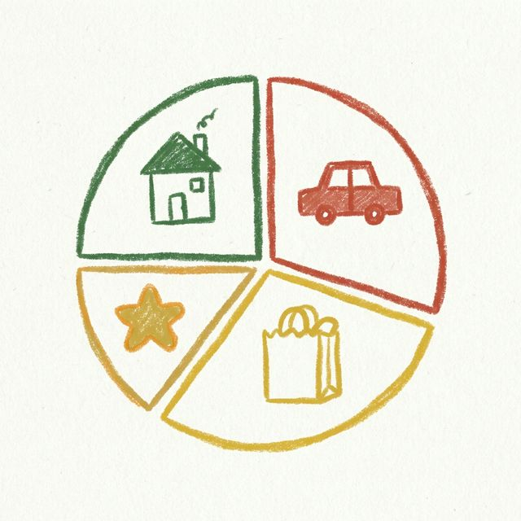

# 🖍️ DoodleSaver - The Crayon Expense Tracker

Welcome to **DoodleSaver**, where tracking money feels like making art! This app replaces boring spreadsheets with a playful, hand-drawn "Storybook Crayon" aesthetic.

## ✨ Features

- **Artistic UI**: A completely custom "Doodle" design system with wobbly borders and crayon textures.
- **Gold Star Expenses**: Mark important purchases with a wobbly star toggle.
- **Google Pay Style Splitting**: Quickly split bills with 1, 2, or 10 friends right in the "New Expense" form.
- **Financial Scribbles**: A summary page with "doodle charts" to visualize your spending.
- **Indian Rupee Support**: Optimized for INR (₹) out of the box.

## 🛠️ Built With

- **React Native** (Expo)
- **Lucide Icons**
- **AsyncStorage** (Local Offline Storage)
- **Custom Font**: Patrick Hand (Google Fonts)

## 🚀 Getting Started

1. Clone this repo: `git clone https://github.com/YOUR_USERNAME/doodle-saver.git`
2. Install dependencies: `npm install`
3. Start the app: `npx expo start`
4. For web: `npx expo start --web`

## 🎨 Aesthetic

This project aims to prove that financial apps don't have to be cold and corporate. It uses a palette of **Forest Green, Mustard Yellow, and Brick Red** on a soft **Cream Paper** background.

---

_Created with ❤️ for a better spending experience._
